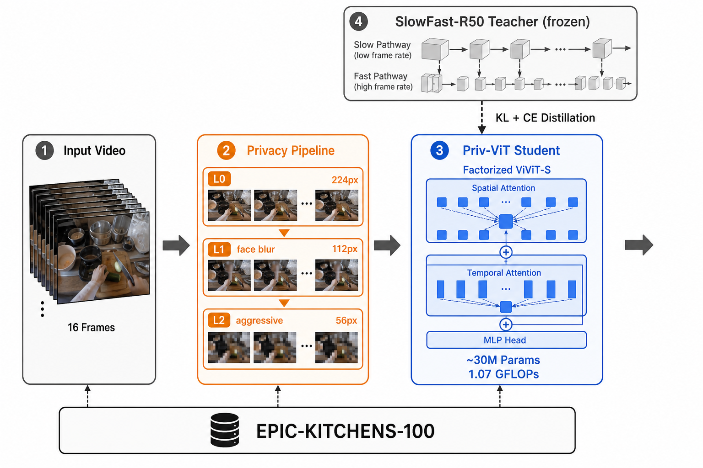

# Priv-ViT: Privacy-Preserving Egocentric Activity Recognition

Lightweight Vision Transformer for on-device action recognition that maintains accuracy under aggressive visual privacy filtering.

## Results

| Privacy Level | Input Size | Top-1 | Top-5 | GFLOPs | FPS (A100) |
|---|---|---|---|---|---|
| Level 0 (baseline) | 224×224 | 27.09% | 59.05% | 1.07 | 71.7 |
| Level 1 (face blur) | 112×112 | 26.44% | 61.21% | 1.07 | 71.7 |
| Level 2 (aggressive) | 56×56 | **28.06%** | **63.81%** | 1.07 | 71.7 |

**103.6% Level-2 recovery** — aggressive privacy filtering *improved* generalisation via a regularisation effect.

## Method



Three-level privacy pipeline → factorised ViViT-S student ← cross-fidelity KL+CE distillation from frozen SlowFast-R50 teacher.

## Key Findings

- Privacy filtering at Level 2 outperforms the clean baseline (103.6% recovery)
- 66× compute reduction vs ViViT-B (1.07 vs 71.2 GFLOPs)
- On-device capable: 8.3 FPS on CPU, 71.7 FPS on A100

## Repository Layout

```text
priv-vit/
├── README.md
├── priv_vit_train.ipynb      # Full training & evaluation pipeline
├── process_dataset_local.py  # Local EPIC-KITCHENS clip extraction
├── requirements.txt
└── assets/
    └── architecture.png
```

## Reproduce

### 1. Install dependencies

```bash
pip install -r requirements.txt
```

### 2. Dataset download

Download RGB frame `.tar` files for participants **P01, P06, P07, P09, P11, P12** from [Academic Torrents](https://academictorrents.com/) (EPIC-KITCHENS-100) and place them under `dataset/`:

```text
dataset/
├── P01/rgb_frames/P01_101.tar
├── P06/rgb_frames/...
└── ...
```

### 3. Local dataset processing

```bash
python process_dataset_local.py
```

This reads frames directly from `.tar` archives, samples 16 frames per action segment, resizes to 224×224, and writes compressed `.npz` clips to `cv_project/processed_clips/`. Annotation CSVs are downloaded automatically.

Output structure (upload `cv_project/` to Google Drive for Colab training):

```text
cv_project/
├── annotations/
├── processed_clips/
│   ├── train/
│   └── val/
├── checkpoints/
└── logs/
```

### 4. Train on Google Colab

1. Upload the entire `cv_project/` folder to Google Drive (e.g. `My Drive/cv_project/`).
2. Open [`priv_vit_train.ipynb`](priv_vit_train.ipynb) in Colab.
3. In the **Configuration** cell, set `DRIVE_ROOT` to your Drive path (e.g. `/content/drive/MyDrive/cv_project`).
4. Select **GPU** runtime (`Runtime → Change runtime type`).
5. Run all cells top-to-bottom.

The notebook runs: privacy transforms → Priv-ViT training with SlowFast-R50 distillation → multi-level evaluation and benchmark plots.

### 5. Train locally (optional)

Set `DRIVE_ROOT = './cv_project'` in the notebook configuration cell and run with a CUDA-capable GPU. Local training skips the Colab disk cache step.

## Citation

This is a course project (CS 6384, UT Dallas, Spring 2026), not a published paper.
If you build on this implementation, please cite the works it is based on:

**EPIC-KITCHENS-100 (dataset):**
```bibtex
@article{Damen2022RESCALING,
  author    = {Damen, Dima and Doughty, Hazel and Farinella, Giovanni Maria and
               Furnari, Antonino and Ma, Jian and Kazakos, Evangelos and
               Moltisanti, Davide and Munro, Jonathan and Perrett, Toby and
               Price, Will and Wray, Michael},
  title     = {Rescaling Egocentric Vision: Collection, Pipeline and Challenges
               for EPIC-KITCHENS-100},
  journal   = {International Journal of Computer Vision},
  year      = {2022},
  volume    = {130},
  pages     = {33--55},
  url       = {https://doi.org/10.1007/s11263-021-01531-2}
}
```

**ViViT (student backbone):**
```bibtex
@InProceedings{Arnab2021ViViT,
  author    = {Arnab, Anurag and Dehghani, Mostafa and Heigold, Georg and
               Sun, Chen and Lu\v{c}i\'c, Mario and Schmid, Cordelia},
  title     = {{ViViT}: A Video Vision Transformer},
  booktitle = {Proceedings of the IEEE/CVF International Conference on
               Computer Vision (ICCV)},
  year      = {2021},
  pages     = {6836--6846}
}
```

**SlowFast-R50 (distillation teacher):**
```bibtex
@InProceedings{Feichtenhofer2019SlowFast,
  author    = {Feichtenhofer, Christoph and Fan, Haoqi and
               Malik, Jitendra and He, Kaiming},
  title     = {{SlowFast} Networks for Video Recognition},
  booktitle = {Proceedings of the IEEE/CVF International Conference on
               Computer Vision (ICCV)},
  year      = {2019},
  pages     = {6202--6211}
}
```

**SPAct (privacy-preserving recognition baseline):**
```bibtex
@InProceedings{Dave2022SPAct,
  author    = {Dave, Ishan and Gupta, Rohit and Rizve, Mamshad Nayeem
               and Shah, Mubarak},
  title     = {{SPAct}: Self-Supervised Privacy Preservation for Action Recognition},
  booktitle = {Proceedings of the IEEE/CVF Conference on Computer Vision
               and Pattern Recognition (CVPR)},
  year      = {2022}
}
```

**RetinaFace (face detection in privacy pipeline):**
```bibtex
@InProceedings{Deng2020RetinaFace,
  author    = {Deng, Jiankang and Guo, Jia and Ververas, Evangelos and
               Kotsia, Irene and Zafeiriou, Stefanos},
  title     = {{RetinaFace}: Single-Shot Multi-Level Face Localisation in the Wild},
  booktitle = {Proceedings of the IEEE/CVF Conference on Computer Vision
               and Pattern Recognition (CVPR)},
  year      = {2020}
}
```

**MobileViT (efficiency baseline):**
```bibtex
@InProceedings{Mehta2022MobileViT,
  author    = {Mehta, Sachin and Rastegari, Mohammad},
  title     = {{MobileViT}: Light-Weight, General-Purpose, and
               Mobile-Friendly Vision Transformer},
  booktitle = {International Conference on Learning Representations (ICLR)},
  year      = {2022}
}
```

**Knowledge distillation:**
```bibtex
@inproceedings{Hinton2015Distilling,
  author    = {Hinton, Geoffrey and Vinyals, Oriol and Dean, Jeff},
  title     = {Distilling the Knowledge in a Neural Network},
  booktitle = {NeurIPS Deep Learning and Representation Learning Workshop},
  year      = {2015}
}
```
